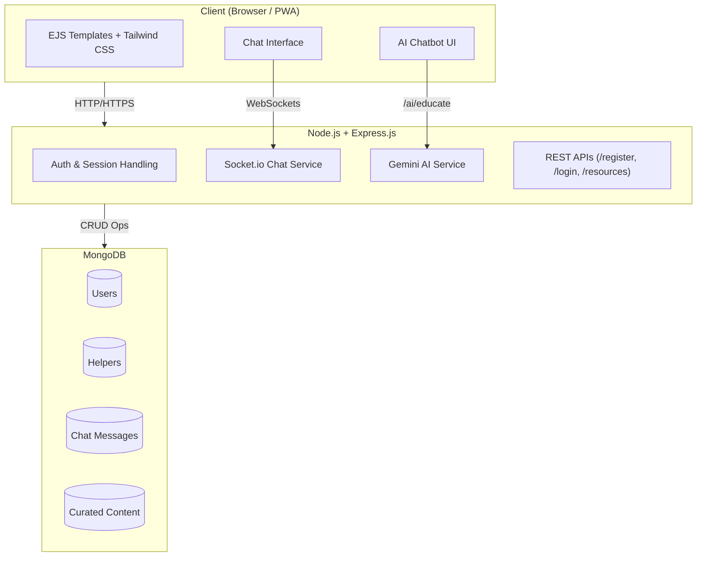

# Sahay — Student-Centered Stress Support Platform

Sahay is a **minimal, student-focused mental well-being platform** designed to help young learners reduce stress, connect with peers, and access curated knowledge about mental health. The platform is lightweight, responsive, and built with a calming, distraction-free UI to ensure a psychologically soothing user experience.

---

##  Features

### Student Features

* Register and login securely using MongoDB-backed authentication
* Join a **real-time group chat** with other students (Socket.io)
* Chat with an **AI-powered Educator Bot** (Google Gemini API) to learn about stress, its effects, and coping strategies
* Access curated resources such as **articles, videos, and helpful links**

### Helper Features

* Separate **helper registration and login** system
* Ability to view and connect with student users
* Acts as a supportive mentor role in the platform

### AI Chatbot (Educator Bot)

* Powered by **Google Gemini API (@google/genai)**
* Provides stress-related explanations in **clear, student-friendly language**
* Educates users about stress, mental health, and coping strategies

### PWA Support

* Installable on **phones, laptops, and tablets**
* Works offline with **service worker caching**
* Provides a seamless, app-like user experience

---

##  Tech Stack

* **Backend:** Node.js, Express.js
* **Templating:** EJS (with partials for modular design)
* **Database:** MongoDB (local instance)
* **Styling:** Tailwind CSS via CDN
* **Real-time Communication:** Socket.io
* **AI Integration:** Google Gemini API
* **PWA:** Service workers + manifest

---

## Project Structure

```
sahay/
├── public/
│   ├── css/
│   └── js/
├── views/
│   ├── partials/        # navbar.ejs, footer.ejs, sidebar.ejs
│   ├── pages/           # index.ejs, login.ejs, register.ejs, dashboard.ejs, chat.ejs
├── routes/
│   ├── auth.js
│   ├── student.js
│   ├── helper.js
│   └── chat.js
├── models/
│   ├── User.js
│   ├── Message.js
│   └── Helper.js
├── services/
│   └── geminiAI.js
├── app.js
├── package.json
└── README.md
```

---

##  System Architecture



---

## Key Functional Modules

* **Authentication:**

  * Students and helpers have **separate models** and login flows
  * Sessions maintained via Express + MongoDB

* **Group Chat (Socket.io):**

  * Persistent single chat server
  * Messages stored in MongoDB for history

* **AI Integration (Google Gemini):**

  * Simple wrapper in `services/geminiAI.js`
  * Endpoint `/ai/educate` to query AI and return JSON response

* **Resource Hub:**

  * Curated resources accessible from `/resources`
  * Can include articles, YouTube links, and embedded content

* **PWA:**

  * `manifest.json` for installability
  * Service worker for offline support

---

## Routes Overview

| Route              | Method | Description                       | Returns               |
| ------------------ | ------ | --------------------------------- | --------------------- |
| `/register`        | POST   | Register new student/helper       | Success/Error message |
| `/login`           | POST   | Login for student/helper          | Session/JWT           |
| `/chat`            | GET    | Group chat UI (EJS page)          | HTML page             |
| `/chat/send`       | POST   | Send message                      | JSON status           |
| `/ai/educate`      | POST   | Ask AI chatbot                    | AI response (JSON)    |
| `/helper/register` | POST   | Register a helper                 | Success/Error message |
| `/resources`       | GET    | Get curated mental health content | JSON list             |

---

## Highlights

* **Student-first design**: Minimal, peaceful UI aimed at lowering cognitive load
* **Community + AI**: Real-time peer support complemented by AI-driven education
* **Extensible**: Easily extendable to include private chats, video sessions, or gamification
* **Lightweight stack**: Simple, understandable codebase for fast iteration

---

🌟 Highlights

Student-first design: Minimal, peaceful UI aimed at lowering cognitive load

Community + AI: Real-time peer support complemented by AI-driven education

Extensible: Easily extendable to include private chats, video sessions, or gamification

Lightweight stack: Simple, understandable codebase for fast iteration

🧩 Design Decisions & Rationale

To keep the project focused and practical, the following architectural and technical choices were made:

Node.js + Express.js

Chosen for its simplicity, non-blocking I/O, and wide community adoption.

Makes it easy to handle both REST endpoints and WebSockets in the same application.

EJS Templating (instead of React/Angular)

EJS is lightweight, server-rendered, and integrates directly with Express.

Reduces complexity by avoiding build pipelines (Webpack/Vite).

Fits the minimal, fast-to-render design needed for students accessing from low-powered devices.

MongoDB (local instance)

Schema flexibility allows modeling both students and helpers without rigid schemas.

Documents are naturally suited for storing chat messages and resources.

Local instance avoids cloud dependency, ensuring offline-first development.

Tailwind CSS via CDN (instead of custom CSS framework)

Keeps design consistent and minimal without extra CSS boilerplate.

CDN usage means zero setup overhead and faster prototyping.

Tailwind’s utility-first approach helps maintain a clean and scalable design system.

Socket.io for Group Chat

Provides event-driven real-time communication without reinventing WebSocket handling.

A single chatroom keeps the MVP simple while still demonstrating real-time collaboration.

Messages are persisted in MongoDB for history retrieval.

Google Gemini API (AI Educator Bot)

Offers contextual, educational responses rather than just generic Q&A.

Provides a practical example of AI integration into user-facing platforms.

Keeps the AI component lightweight (just one service wrapper) and extensible.

PWA Support

Students can install the platform like a mobile app without needing a native build.

Service workers improve offline availability, important for areas with poor connectivity.

Future-ready design: platform can later include push notifications, caching strategies, etc.

🔮 Future Improvements

Scalability: Move MongoDB to a managed service (MongoDB Atlas) and add connection pooling.

Chat Extensions: Add private/group-specific rooms, file sharing, or voice/video calls.

Authentication: Upgrade from session-based login to JWT + refresh tokens.

Resource Hub: Allow helpers/admins to upload and categorize resources dynamically.

AI Enhancement: Personalize responses by analyzing chat history or mood inputs.
